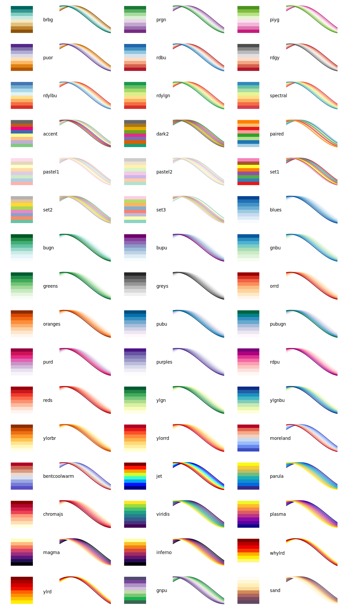

Color palettes for gnuplot
==========================

In order to use a palette load it at the beginning of your gnuplot file via
```Gnuplot
load 'palette.pal'
```
Replace `palette` by the name of your desired palette, which are listed below.  
Note, that this will not only define a palette, but also overwrite the first
eight line styles. If you want to use your own line styles, you have to define
them after the above command.

If you need more help, have a look at
[this example](http://www.gnuplotting.org/ease-your-plotting-with-config-snippets/).

Most of the palettes are from [ColorBrewer](http://colorbrewer2.org/) and were
first ported to gnuplot by [Anna
Schneider](https://github.com/aschn/gnuplot-colorbrewer).

If you look for a good standard palette try `moreland.pal`, which comes from
[Kenneth Moreland](http://www.sandia.gov/~kmorel/documents/ColorMaps/).


